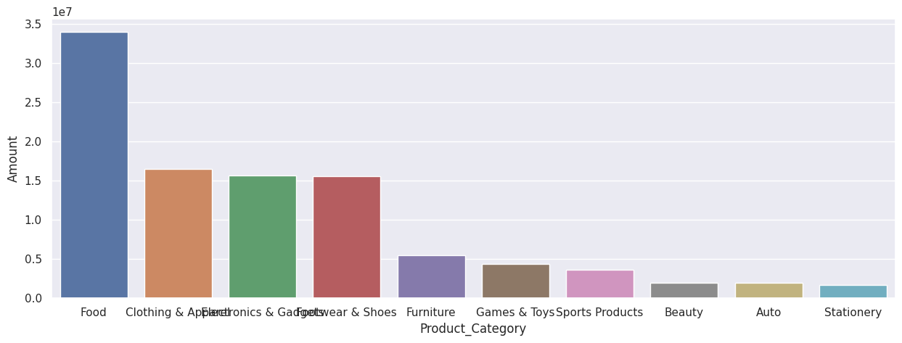
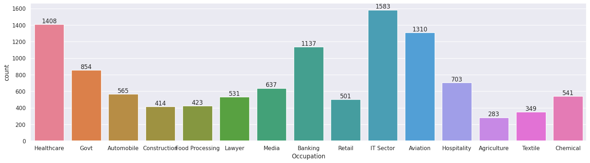

# Diwali Sales Data Analysis

This Python script performs exploratory data analysis (EDA) on a dataset containing Diwali sales data. The dataset includes information such as customer demographics, purchase details, and product categories. The analysis aims to uncover insights into customer behavior, popular product categories, and regional sales trends during the Diwali season.

# Key Steps:

--Data Loading and Preparation:

The script loads the dataset from a CSV file and examines its structure and contents.
It removes unnecessary columns and handles missing values to prepare the data for analysis.
Data Exploration:

The script explores various aspects of the dataset using visualizations such as bar plots and count plots.
It analyzes factors such as gender, age group, state, marital status, occupation, product category, and product ID to identify patterns and trends in customer behavior and sales.

Insights and Interpretations:

The visualizations provide insights into customer demographics, purchasing preferences, and regional variations in sales.
Key findings include the dominance of female customers, popular product categories such as food, clothing, and electronics, and the influence of factors like age group and occupation on purchasing behavior.

Usage:

Ensure that the required Python libraries (NumPy, Pandas, Matplotlib, Seaborn) are installed.
Run the script with the provided Diwali sales dataset (Diwali Sales Data.csv) to perform exploratory data analysis.

Conclusion:

The analysis offers valuable insights into Diwali sales trends, which can inform marketing strategies, product offerings, and regional targeting for future sales campaigns.